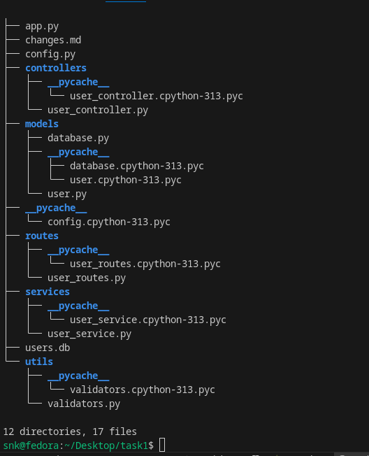

1. Code Organization 
I have properly organinize file structure as the image  provided below 

2. Security Improvements
 I have fixed  some  SQL Injection Vulnerabilities 
Before
query = f"SELECT * FROM users WHERE id = '{user_id}'"
cursor.execute(query)
After 
cursor.execute("SELECT * FROM users WHERE id = ?", (user_id,))

3. Database Connection Management
Before
conn = sqlite3.connect('users.db', check_same_thread=False)  
cursor = conn.cursor()

After
def get_connection(self):
    return sqlite3.connect(self.db_path, check_same_thread=False)

conn = self.db.get_connection()

conn.close()  

4. Error Handling Implementation

try:
    user = self.user_service.get_user_by_id(user_id)
    return jsonify(user), 200
except ValueError as e:
    return jsonify({"error": str(e)}), 400
except Exception as e:
    return jsonify({"error": str(e)}), 500

    And I have tested the endpoints ,is it working or not , and what the result is , it's working perfectily " :)"     

    if i get more time i will try to find more issues , and make frontend for this :) 

